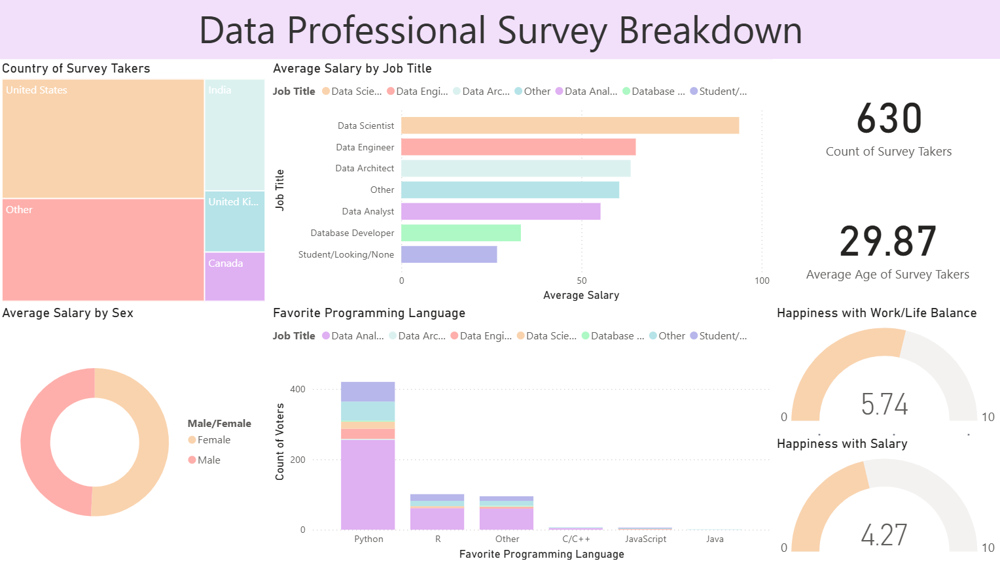

# Power BI: Data Professional Survey Analysis                

> Reference source: https://github.com/AlexTheAnalyst/Power-BI

      
This repository contains a Power BI project that analyzes survey data from data professionals. The goal of this project is to uncover insights related to job satisfaction, salary, demographics, and career paths within the data industry. The interactive dashboard visualizes key trends to help understand the current landscape for data professionals.

## 📝 Project Overview
The dashboard provides a comprehensive overview of the data professional landscape. It addresses key questions about what drives happiness in a role, what professionals look for in new opportunities, and how factors like programming language, industry, and education influence salary and career progression.

## ❓ Key Questions Addressed:
- What is the demographic profile of data professionals (age, gender, country, education)?
- How does salary vary across different job titles, industries, and countries?
- What are the most popular programming languages among data professionals?
- What are the primary drivers of job satisfaction (e.g., salary, work-life balance, management)?
- How difficult do professionals find it to break into the data field?
- What are the most important factors for professionals when considering a new job?

## 📊 Data Source
The analysis is based on a single CSV file: [dataset](Final_Project.xlsx)

Description: This file contains anonymized survey responses from 630 data professionals. It includes columns on job titles, salary, industry, job satisfaction ratings, favorite programming languages, and demographic information.

## 🛠️ Tools and Technologies

- Visualization & Analysis: Microsoft Power BI
- Data Transformation: Power Query Editor
- Calculations & Modeling: Data Analysis Expressions (DAX)

## 🔄 ETL Process (Data Cleaning & Transformation)
The raw data was processed using the Power Query Editor within Power BI to ensure accuracy and consistency. The key transformation steps included:
- Data Profiling: Initial review of data quality, column distribution, and identification of errors.
- Column Cleaning:
  - Renamed columns for better readability (e.g., Q1 - Which Title Best Fits... to Job Title).
  - Removed redundant or unnecessary columns (Browser, OS, Referrer).
- Data Type Correction: Ensured numerical columns (like Age and satisfaction scores) and date columns were set to the correct data types.
- Handling Missing Values: Addressed null or blank values where necessary, typically by removing rows with incomplete satisfaction scores to avoid skewing the analysis.
- Categorical Data Cleaning: Cleaned and consolidated inconsistent values in columns like Q4 - What Industry do you work in? where "Other (Please Specify):" prefixes were removed.
- Calculated Columns: Created new columns using DAX to add analytical value, such as: 
  - Age Groups: Grouping respondents into age brackets for easier demographic analysis.
  - Salary Bins: Converting salary ranges into ordered categories for better visualization.
  - Average Satisfaction Score: Calculating a single happiness metric per respondent based on their ratings for salary, work-life balance, coworkers, etc.

## ✨ Dashboard Features
The Power BI report [Survey.pbix](Survey.pbix) is designed to be fully interactive and user-friendly.

**Interactive Visualizations**: Includes a variety of charts such as bar charts, pie charts, scatter plots, and maps to explore the data from different angles.

**Slicers & Filters**: Users can dynamically filter the entire report by Job Title, Country, Salary Range, and Favorite Programming Language.

**KPI Cards**: At-a-glance metrics show key figures like the total number of survey respondents, average age, and overall average job satisfaction.

**Drill-Down & Tooltips**: Hover over data points to see more detailed information or drill down into specific categories for a more granular view.

## 🚀 How to Use
To explore the dashboard, you will need:
- Microsoft Power BI Desktop installed
- Clone or download this repository
- Open the [Survey.pbix](Survey.pbix) file in Power BI Desktop
- Interact with the slicers on the left-hand side to filter the data
- Hover over visuals to see detailed tooltips and insights.

